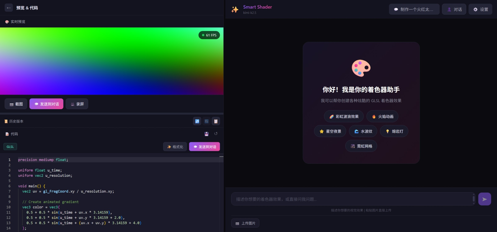
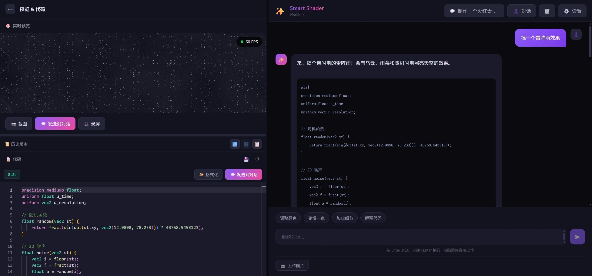
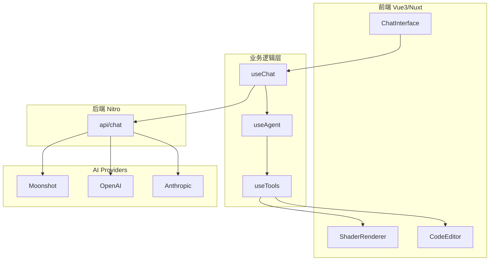
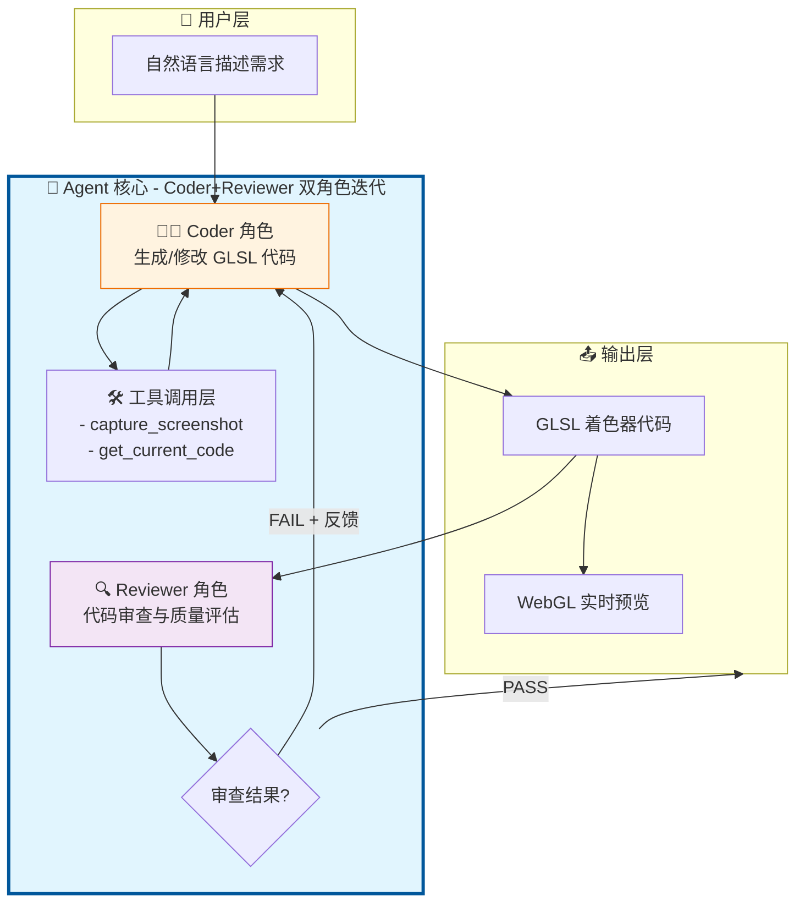
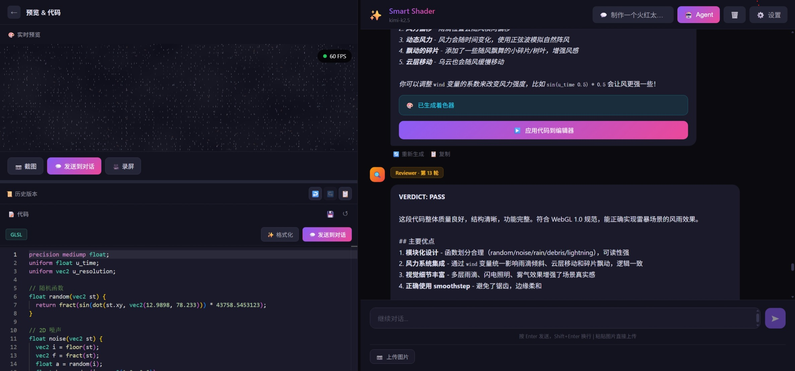
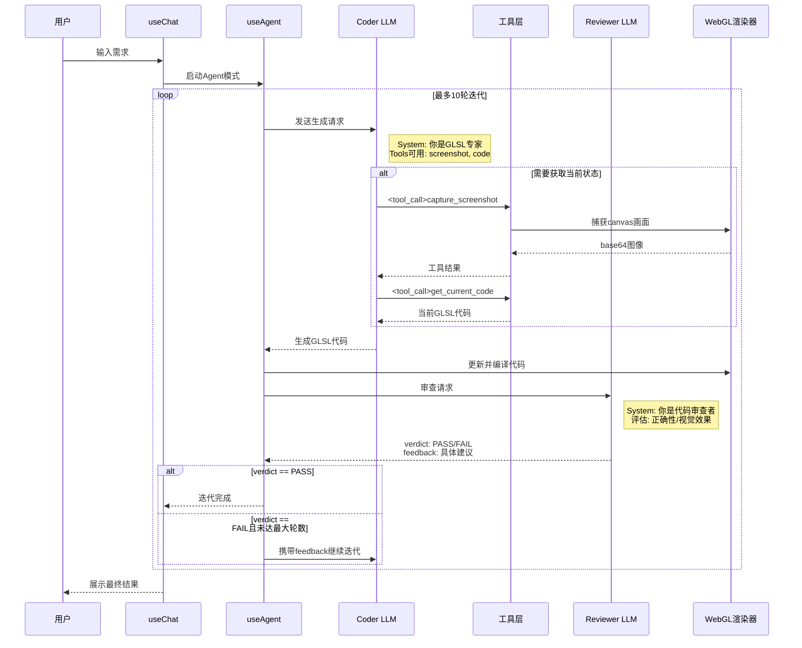
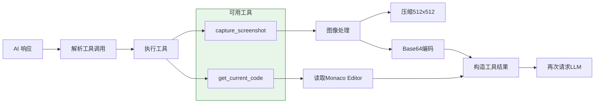

# Smart Shader - AI 驱动 GLSL 着色器生成系统

> 🎯 **技术亮点**：Multi-Agent 协作框架 · 工具调用（Tool Calling）· 多模态视觉理解 · 流式对话系统 · 多 AI 提供商适配

一个基于 **Nuxt 4** 的全栈应用，通过自然语言与 AI 交互，自动生成、迭代优化 GLSL 片段着色器代码，并提供实时 WebGL 预览。项目核心创新是实现了 **Coder + Reviewer 双角色 Agent 自动迭代模式**，让 AI 具备自我修正能力。

[](https://github.com/Haiyang-Bian/smart-shader)
[](https://nuxt.com/)
[](LICENSE)

---

## 🚀 核心创新

| 技术方向 | 实现内容 |
|---------|---------|
| **Multi-Agent 系统** | 独创 Coder + Reviewer 双角色协作，模拟人类"编码-审查-修复"循环 |
| **工具调用（Tool Calling）** | 实现 `capture_screenshot`、`get_current_code` 工具，架构层统一支持多提供商 |
| **多模态交互** | 支持图片上传/粘贴，AI 基于视觉反馈优化着色器效果 |
| **流式对话系统** | SSE 实时流式响应，支持打字机效果与代码块实时提取 |
| **多 AI 提供商适配** | 统一抽象层支持 OpenAI、Anthropic、Moonshot、OpenRouter、Ollama |

### 软件主界面



### 交互示意图



---

## 🏗️ 系统架构



---

## 🤖 Agent 智能体核心设计

### 双角色协作流程



#### 智能体模式工作图



### 时序图：完整迭代流程



### 状态机设计

```typescript
// Agent 运行状态
 type AgentStatus = 
   | 'idle'      // 空闲，等待启动
   | 'coding'    // Coder 正在生成代码
   | 'reviewing' // Reviewer 正在审查
   | 'done'      // 迭代完成（通过或达到最大轮数）
   | 'error'     // 发生错误

// 单轮迭代结果
 interface IterationResult {
   round: number            // 当前轮数 (1-10)
   code: string             // 生成的代码
   verdict: 'PASS' | 'FAIL' // 审查结果
   feedback: string         // 审查反馈
 }
```

---

## 🛠️ 工具调用（Tool Calling）实现

工具调用使 AI 能够感知当前应用状态，是实现自我修正的关键。

> 设计上采用统一抽象层，理论支持所有 OpenAI 兼容格式的 LLM 提供商，当前在 Moonshot (Kimi) 模型上完成完整测试。



### 工具定义示例

```typescript
// server/api/chat.post.ts
const tools: Tool[] = [
  {
    type: 'function',
    function: {
      name: 'capture_screenshot',
      description: '捕获当前WebGL渲染画面，用于视觉反馈',
      parameters: { type: 'object', properties: {} }
    }
  },
  {
    type: 'function',
    function: {
      name: 'get_current_code',
      description: '获取编辑器当前GLSL代码',
      parameters: { type: 'object', properties: {} }
    }
  }
]
```

---

## 💡 技术挑战与解决方案

### 1. Agent 异步对话的状态管理

**挑战**：传统聊天是"一问一答"同步模式，但 Agent 需要在一个用户消息触发多轮 AI 对话（Coder→Reviewer→可能继续迭代），同时保持 UI 可交互。

**解决方案**：

- 设计分层状态机：`useAgent` 管理迭代状态，`useChat` 管理消息列表
- Agent 内部调用 `useChat.addMessage()` 添加中间消息，但对用户隐藏迭代过程
- 支持用户随时介入，发送新消息可中断当前迭代

```typescript
// useAgent.ts 核心逻辑
async function runAgentLoop(userInput: string) {
  status.value = 'coding'
  let currentRound = 1

  while (currentRound <= MAX_ROUNDS) {
    // Coder 生成
    const code = await callCoderLLM(context)
    
    // Reviewer 审查
    status.value = 'reviewing'
    const review = await callReviewerLLM(code)
    
    if (review.verdict === 'PASS') {
      status.value = 'done'
      break
    }
    
    // 准备下一轮
    context.push({ role: 'user', content: review.feedback })
    currentRound++
    status.value = 'coding'
  }
}
```

### 2. 流式响应中的代码实时提取

**挑战**：SSE 流式返回 Markdown 代码块，需要在流的过程中实时识别完整代码并更新编辑器。

**解决方案**：

- 使用正则表达式匹配 Markdown 代码块边界（```glsl ...```）
- 前端维护缓冲区，每收到新 chunk 尝试提取
- 提取成功后立即更新 Monaco Editor，无需等待流结束

```typescript
// useChat.ts 中的流式处理
const codeBlockRegex = /```(?:glsl)?\s*([\s\S]*?)```/

eventSource.onmessage = (e) => {
  const data = JSON.parse(e.data)
  buffer += data.content
  
  // 尝试提取代码
  const match = buffer.match(codeBlockRegex)
  if (match) {
    extractedCode = match[1]
    updateEditor(extractedCode) // 实时更新
  }
  
  // 继续追加到消息显示
  currentMessage.content += data.content
}
```

### 3. 多 AI 提供商的统一抽象

**挑战**：不同提供商 API 格式不同（OpenAI 风格 vs Anthropic 风格），需要统一适配。

**解决方案**：

- 设计统一的 `ChatMessage` 和 `ChatOptions` 接口
- 每个提供商实现适配器函数，统一转换为各自格式
- 支持工具调用、流式响应、视觉输入的差异化处理

```typescript
// 统一接口
interface ChatOptions {
  messages: ChatMessage[]
  model: string
  temperature?: number
  tools?: Tool[]
  stream?: boolean
}

// 适配器模式
const adapters = {
  openai: adaptToOpenAIFormat,
  anthropic: adaptToAnthropicFormat,
  moonshot: adaptToOpenAIFormat // Moonshot兼容OpenAI格式
}
```

---

## ✨ 核心特性

### 1. AI 对话生成着色器

- 自然语言描述自动生成 GLSL 片段着色器
- 代码自动提取并应用到编辑器
- 支持代码解释、调试、优化等后续对话

### 2. Agent 智能体模式

- **Coder 角色**：根据需求生成/修改代码，可调用工具
- **Reviewer 角色**：审查代码输出 PASS/FAIL verdict
- **自动迭代**：FAIL 时自动携带反馈继续修改，最多 10 轮

### 3. 多模态视觉交互

- 支持上传图片或粘贴截图到对话
- AI 基于渲染截图给出视觉层面的优化建议
- 截图自动压缩为 512x512，节省 Token

### 4. 工具调用能力

- `capture_screenshot`：捕获当前 WebGL 画面
- `get_current_code`：获取编辑器当前代码
- 工具结果作为上下文再次输入 LLM

### 5. 实时 WebGL 预览

- 原生 WebGL 1.0 渲染
- 自动注入 `u_time`（时间）和 `u_resolution`（分辨率）uniform
- FPS 性能监控，低性能时自动警告

### 6. 多 AI 提供商支持

| 提供商 | 视觉支持 | 工具调用 | 特点 |
|--------|----------|----------|------|
| Moonshot (Kimi) | ✅ | ✅* | 推荐主力使用 |
| OpenAI | ✅ | ✅* | GPT-4 / GPT-4o |
| Anthropic | ✅ | ✅* | Claude 3 系列 |
| OpenRouter | 视模型 | ✅* | 多模型聚合 |
| Ollama | 视模型 | ✅* | 本地部署 |

> *工具调用在架构层面已统一抽象支持所有提供商，目前产品层仅在 Moonshot (Kimi) 上完成完整测试。

---

## 📊 数据流设计

### 双层数据持久化

```
┌─────────────────────────────────────────────────────────────┐
│                        浏览器端                              │
│  ┌─────────────────────────────────────────────────────┐   │
│  │  LocalStorage (主存储)                               │   │
│  │  - shader-conversations: 对话列表和消息历史          │   │
│  │  - shader-settings: AI 设置                          │   │
│  └─────────────────────────────────────────────────────┘   │
└──────────────────────────────────┬──────────────────────────┘
                                   │ HTTP / SSE
                                   │
┌──────────────────────────────────▼──────────────────────────┐
│                       服务端 (Nitro)                        │
│  ┌─────────────────────────────────────────────────────┐   │
│  │  SQLite .data/admin.db (副本/审计)                   │   │
│  │  - conversations: 对话元数据                         │   │
│  │  - messages: 消息内容 + 原始 AI 响应 (JSON)          │   │
│  └─────────────────────────────────────────────────────┘   │
└─────────────────────────────────────────────────────────────┘
```

**设计考量**：

- 用户数据主要保存在浏览器，保护隐私，无需登录
- 服务端仅作为 Admin 后台的只读副本，每次聊天时同步写入
- 服务端数据用于调试分析，查看 AI 的原始响应内容

---

## 🛠️ 技术栈

| 层级 | 技术 |
|------|------|
| 框架 | Nuxt 4 + Vue 3 (Composition API) |
| 语言 | TypeScript |
| UI 组件 | Nuxt UI 4 |
| 代码编辑器 | Monaco Editor (GLSL 语法高亮) |
| 渲染 | 原生 WebGL 1.0 API |
| 状态持久化 | LocalStorage + SQLite |
| 服务端 | Nitro (Nuxt 内置) |

---

## 📁 项目结构

```
smart-shader/
├── app/                          # Nuxt 应用目录
│   ├── components/               # Vue 组件
│   │   ├── ChatInterface.vue     # 聊天界面（核心）
│   │   ├── ShaderRenderer.vue    # WebGL 渲染器
│   │   ├── CodeEditor.vue        # Monaco 代码编辑器
│   │   └── ...
│   ├── composables/              # 组合式函数
│   │   ├── useChat.ts            # 聊天状态与流式请求 ⭐
│   │   ├── useAgent.ts           # Agent 智能体核心 ⭐
│   │   ├── useTools.ts           # AI 工具调用实现 ⭐
│   │   ├── useConversations.ts   # 多对话管理
│   │   └── useShaderHistory.ts   # 版本历史
│   └── pages/
│       └── index.vue             # 主页面
├── server/                       # Nitro 服务端 API
│   └── api/
│       ├── chat.post.ts          # 聊天主接口（流式/非流式）⭐
│       ├── models.get.ts         # 获取模型列表
│       └── ...
├── types/
│   └── index.ts                  # TypeScript 类型定义
└── nuxt.config.ts
```

---

## 🚀 快速开始

### 环境要求

- Node.js >= 18
- npm 或 pnpm

### 安装依赖

```bash
npm install
```

### 开发模式

```bash
npm run dev
```

访问 `http://localhost:3000`

### 生产构建

```bash
npm run build
npm run preview
```

---

## 📖 使用指南

### 普通模式

1. 打开页面，点击右上角 **⚙️ 设置**，选择 AI 提供商并输入 API Token
2. 在输入框描述你想要的视觉效果，按 Enter 发送
3. AI 生成代码后，右侧预览区会实时更新

### Agent 模式

1. 点击顶部 **Agent** 按钮开启智能体模式
2. 描述需求后，Agent 会自动：
   - Coder 生成初始代码
   - Reviewer 审查代码并给出 verdict
   - 不通过则自动迭代修改
3. 可随时发送消息介入迭代过程

### 上传截图优化

1. 点击渲染区下方的 **📷 截图** 或 **💬 发送到对话**
2. 在输入框中描述修改意见（如"颜色太亮了"）
3. 发送后 AI 会基于截图给出针对性优化

---

## 🎓 技术深度

### 工程实践要点

| 领域 | 技术实现 |
|------|---------|
| **AI Agent 设计** | Multi-Agent 协作架构、ReAct 推理模式、自我修正机制 |
| **Tool Calling 实现** | 工具注册、调用、结果回传的完整链路 |
| **LLM 应用开发** | SSE 流式响应、多提供商 API 适配、提示词工程 |
| **前端状态管理** | Vue3 Composition API、分层状态设计、跨组件通信 |
| **WebGL 渲染** | 原生 WebGL API、着色器编译、性能监控 |

---

## 📄 许可证

MIT License
